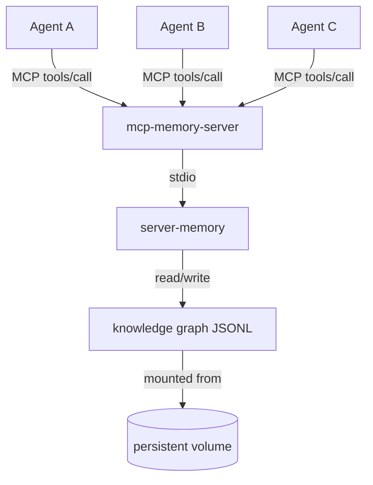
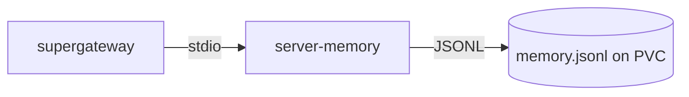

# mcp-memory-server

A persistent shared knowledge graph memory service for AI agents, exposed over the [Model Context Protocol (MCP)](https://modelcontextprotocol.io).

Built with [kagent](https://kagent.dev) in mind, but compatible with any agent framework that supports MCP over Streamable HTTP or SSE.

## What it does

Every AI agent invocation starts with a blank context window. This service gives agents a shared, persistent memory they can read from and write to across invocations — structured as a knowledge graph of entities, relations, and observations.



This project exists because there was no straightforward way to deploy a persistent MCP memory server into Kubernetes. The official [`@modelcontextprotocol/server-memory`](https://github.com/modelcontextprotocol/servers/tree/main/src/memory) package is excellent but speaks stdio only — not suitable for multi-agent Kubernetes workloads. This image wraps it with [supergateway](https://github.com/supermaven-inc/supergateway) to expose it over Streamable HTTP, packages everything into a single container, and publishes it to GHCR so it can be deployed with a single image reference. Ready-to-use deployment manifests are available both below and in the [`examples/`](examples/) folder of this repository.

### Knowledge graph model

| Concept | Description | Example |
|---------|-------------|--------|
| **Entity** | A named, typed object | `deployment/my-app` of type `KubernetesResource` |
| **Observation** | A free-text fact attached to an entity | `"OOMKilled 2026-05-16 — limit was 64Mi"` |
| **Relation** | A typed edge between two entities | `deployment/my-app` → `resolved_in` → `github-issue/42` |

### Why a knowledge graph instead of a flat file?

| Concern | Flat file | Knowledge graph |
|---------|-----------|----------------|
| Retrieval | Must read the whole file — grows unbounded | `search_nodes` returns only what's relevant |
| Typed relations | Prose the agent must parse | Machine-traversable edges |
| Concurrent writes | Risk of corruption | Each agent appends observations atomically |
| Pattern detection | Hard to reason over structure | `read_graph` exposes the full entity/relation set |

## MCP tools exposed

| Tool | Description |
|------|-------------|
| `create_entities` | Create named typed entities with initial observations |
| `create_relations` | Link two entities with a typed relation |
| `add_observations` | Append facts to an existing entity |
| `search_nodes` | Full-text search across entity names and observations |
| `open_nodes` | Retrieve specific entities by name |
| `read_graph` | Return the full knowledge graph |
| `delete_entities` | Remove entities and their relations |

## Quick start

### Docker

```bash
docker run -p 3000:3000 -v $(pwd)/data:/data ghcr.io/foxj77/mcp-memory-server:latest
```

The MCP endpoint is available at `http://localhost:3000/mcp`.

### Kubernetes — Helm (recommended)

```bash
helm install mcp-memory-server oci://ghcr.io/foxj77/charts/mcp-memory-server \
  --version 0.2.0 \
  --namespace my-namespace \
  --create-namespace
```

The MCP endpoint will be available at:
```
http://mcp-memory-server.my-namespace.svc.cluster.local:3000/mcp
```

Common overrides:

```bash
# Larger graph storage and higher memory limits
helm install mcp-memory-server oci://ghcr.io/foxj77/charts/mcp-memory-server \
  --version 0.2.0 \
  --namespace my-namespace \
  --set storage.size=10Gi \
  --set resources.limits.memory=1Gi \
  --set nodeHeapSizeMb=384
```

See [`chart/values.yaml`](chart/values.yaml) for all available options and their inline documentation.

### Kubernetes — raw manifest

See [`examples/kubernetes-deployment.yaml`](examples/kubernetes-deployment.yaml) for the full manifest, or apply it directly:

```bash
kubectl apply -f https://raw.githubusercontent.com/foxj77/mcp-memory-server/main/examples/kubernetes-deployment.yaml
```

The manifest creates a PVC, Deployment, and Service. The MCP endpoint will be available at:
```
http://mcp-memory-server.<namespace>.svc.cluster.local:3000/mcp
```

<details>
<summary>View full manifest</summary>

```yaml
apiVersion: v1
kind: PersistentVolumeClaim
metadata:
  name: memory-store
  namespace: my-namespace
spec:
  accessModes: ["ReadWriteOnce"]
  resources:
    requests:
      storage: 2Gi
---
apiVersion: apps/v1
kind: Deployment
metadata:
  name: mcp-memory-server
  namespace: my-namespace
spec:
  replicas: 1
  selector:
    matchLabels:
      app: mcp-memory-server
  template:
    metadata:
      labels:
        app: mcp-memory-server
    spec:
      containers:
        - name: mcp-memory-server
          image: ghcr.io/foxj77/mcp-memory-server:latest
          imagePullPolicy: Always
          env:
            - name: NODE_OPTIONS
              value: "--max-old-space-size=256"
          ports:
            - containerPort: 3000
          readinessProbe:
            tcpSocket:
              port: 3000
            initialDelaySeconds: 5
            periodSeconds: 10
          livenessProbe:
            tcpSocket:
              port: 3000
            initialDelaySeconds: 15
            periodSeconds: 20
            failureThreshold: 3
          volumeMounts:
            - name: memory-store
              mountPath: /data
          resources:
            requests:
              cpu: 10m
              memory: 256Mi
            limits:
              cpu: 500m
              memory: 768Mi
      volumes:
        - name: memory-store
          persistentVolumeClaim:
            claimName: memory-store
---
apiVersion: v1
kind: Service
metadata:
  name: mcp-memory-server
  namespace: my-namespace
spec:
  selector:
    app: mcp-memory-server
  ports:
    - port: 3000
      targetPort: 3000
```

</details>

## Verifying your deployment

`tests/smoke-test.sh` exercises all seven MCP tools against a running server and shows you exactly what is being stored and retrieved at each step. Run it after any deployment to confirm the server is healthy and the knowledge graph is persisting correctly.

### Prerequisites

```bash
# macOS
brew install curl jq

# Debian / Ubuntu
apt-get install -y curl jq
```

Then clone this repository (or just download the script) so you have `tests/smoke-test.sh` locally:

```bash
git clone https://github.com/foxj77/mcp-memory-server.git
cd mcp-memory-server
```

### Running against a local Docker container

Start the container, then run the test:

```bash
docker run -d -p 3000:3000 -v $(pwd)/data:/data ghcr.io/foxj77/mcp-memory-server:latest
./tests/smoke-test.sh
```

### Running against a Kubernetes deployment

**Option A — port-forward** (no in-cluster networking required):

```bash
kubectl port-forward -n my-namespace svc/mcp-memory-server 3000:3000 &
./tests/smoke-test.sh
kill %1   # stop the port-forward when done
```

**Option B — in-cluster URL** (from a machine that can reach cluster services directly, or from a pod inside the cluster):

```bash
MCP_URL=http://mcp-memory-server.my-namespace.svc.cluster.local:3000/mcp \
  ./tests/smoke-test.sh
```

### What the test does

The script runs 10 steps, printing what is stored and retrieved at each one:

| Step | Tool | What it verifies |
|------|------|-----------------|
| 1 | `initialize` | Session handshake succeeds and returns a session ID |
| 2 | `tools/list` | All 7 tools are registered |
| 3 | *(cleanup)* | Removes any leftover data from a previous run |
| 4 | `create_entities` | Two entities written to the graph with initial observations |
| 5 | `add_observations` | New facts appended to an existing entity without overwriting |
| 6 | `create_relations` | A typed edge created between two entities |
| 7 | `search_nodes` | Full-text search returns the correct entity |
| 8 | `open_nodes` | Entity retrieved by name; accumulated observations are all present |
| 9 | `read_graph` | Full graph returned with correct entity and relation counts |
| 10 | `delete_entities` | Test data removed; graph restored to its previous state |

### Expected output

```
━━ 1  Initialize session
  → Connecting to http://localhost:3000/mcp
✓ Session established (id: abc123…)

━━ 2  List tools
✓ 7 tools registered
  → create_entities, create_relations, add_observations, search_nodes, open_nodes, read_graph, delete_entities

...

━━ 8  open_nodes
✓ smoke-test/deployment has 4 observations (3 initial + 1 appended)
  → "replicas: 3"
  → "image: my-app:v1.2.0"
  → "namespace: production"
  → "memory limit raised to 768Mi after OOMKill incident"

...

────────────────────────────────────────
All 10 tests passed. The memory server is working correctly.
```

The test uses `smoke-test/` prefixed entity names and deletes them on exit, so it is safe to run against a live graph that already holds real data.

## Wiring to kagent

See [`examples/kagent-remote-mcp-server.yaml`](examples/kagent-remote-mcp-server.yaml) for the full manifest. Register the server as a `RemoteMCPServer` and add the tools to each agent's tool list.

```yaml
apiVersion: kagent.dev/v1alpha2
kind: RemoteMCPServer
metadata:
  name: memory-mcp
  namespace: kagent
spec:
  description: Shared persistent knowledge graph memory
  protocol: STREAMABLE_HTTP
  url: http://mcp-memory-server.my-namespace.svc.cluster.local:3000/mcp
  timeout: 30s
  sseReadTimeout: 5m0s
```

Then add tools to each agent based on its role:

```yaml
# Full read + write (resolver, advisor agents)
- type: McpServer
  mcpServer:
    apiGroup: kagent.dev
    kind: RemoteMCPServer
    name: memory-mcp
    toolNames:
      - create_entities
      - create_relations
      - add_observations
      - search_nodes
      - open_nodes
      - read_graph

# Observe + read (analyst agents)
- type: McpServer
  mcpServer:
    apiGroup: kagent.dev
    kind: RemoteMCPServer
    name: memory-mcp
    toolNames:
      - add_observations
      - search_nodes
      - open_nodes
      - read_graph

# Read-only (general-purpose agents)
- type: McpServer
  mcpServer:
    apiGroup: kagent.dev
    kind: RemoteMCPServer
    name: memory-mcp
    toolNames:
      - search_nodes
      - open_nodes
      - read_graph
```

## Wiring to other frameworks

Any agent framework that can make HTTP POST requests to an MCP Streamable HTTP endpoint can use this server. The endpoint speaks standard JSON-RPC 2.0 over HTTP:

```bash
# Initialize a session
curl -si -X POST http://localhost:3000/mcp \
  -H "Content-Type: application/json" \
  -H "Accept: application/json, text/event-stream" \
  -d '{"jsonrpc":"2.0","id":1,"method":"initialize","params":{"protocolVersion":"2024-11-05","capabilities":{},"clientInfo":{"name":"test","version":"1.0"}}}'

# Use the returned mcp-session-id header for subsequent calls
curl -s -X POST http://localhost:3000/mcp \
  -H "Content-Type: application/json" \
  -H "Accept: application/json, text/event-stream" \
  -H "mcp-session-id: <session-id>" \
  -d '{"jsonrpc":"2.0","id":2,"method":"tools/call","params":{"name":"search_nodes","arguments":{"query":"my-app"}}}'
```

## Architecture

This server composes two existing tools:



| Component | Role |
|-----------|------|
| [`@modelcontextprotocol/server-memory`](https://github.com/modelcontextprotocol/servers/tree/main/src/memory) | Knowledge graph implementation stored as JSONL |
| [`supergateway`](https://github.com/supermaven-inc/supergateway) | Bridges the stdio MCP server to Streamable HTTP |

### Key configuration notes

**`--stateful` is required.** In default stateless mode, supergateway spawns a new stdio child process per HTTP connection. Because MCP requires `initialize` before `tools/call` within the same session, stateless mode breaks session continuity. The `--stateful` flag keeps one persistent process.

**Memory limit: 768Mi minimum.** Two Node.js processes run inside the container (supergateway + the memory server child process), each needing ~256MB heap. 512Mi OOMKills under load. Set `NODE_OPTIONS=--max-old-space-size=256` to cap each process.

**`imagePullPolicy: Always` for `:latest` / `:main` tags.** Kubernetes defaults to `IfNotPresent` for non-`:latest` tags, which will serve a cached old image after a new build. Use `Always` if you track a mutable tag.

## Helm chart

The chart is published to GHCR as an OCI artifact alongside every release:

```bash
# List available versions
helm search repo oci://ghcr.io/foxj77/charts/mcp-memory-server

# Pull and inspect
helm pull oci://ghcr.io/foxj77/charts/mcp-memory-server --version 0.2.0
helm show values oci://ghcr.io/foxj77/charts/mcp-memory-server --version 0.2.0
```

## Image

Pre-built multi-arch images (amd64 + arm64) are published to GHCR automatically when a GitHub Release is created. Releases are driven by [Conventional Commits](https://www.conventionalcommits.org/) — `feat:` bumps the minor version, `fix:` / `docs:` / `chore:` bump the patch, and `feat!:` bumps the major.

```
ghcr.io/foxj77/mcp-memory-server:1.2.3       # exact version (immutable)
ghcr.io/foxj77/mcp-memory-server:1.2         # latest patch for 1.2.x
ghcr.io/foxj77/mcp-memory-server:1           # latest minor for 1.x (omitted for 0.x)
ghcr.io/foxj77/mcp-memory-server:latest      # latest stable release
ghcr.io/foxj77/mcp-memory-server:sha-<sha>   # exact commit (every build)
ghcr.io/foxj77/mcp-memory-server:edge        # manual workflow_dispatch build (not a release)
```

For production use, pin to the exact version tag (`1.2.3`) or the minor tag (`1.2`) rather than `latest` to avoid unexpected upgrades. See [GitHub Releases](https://github.com/foxj77/mcp-memory-server/releases) for the full changelog.

## Licence

MIT
