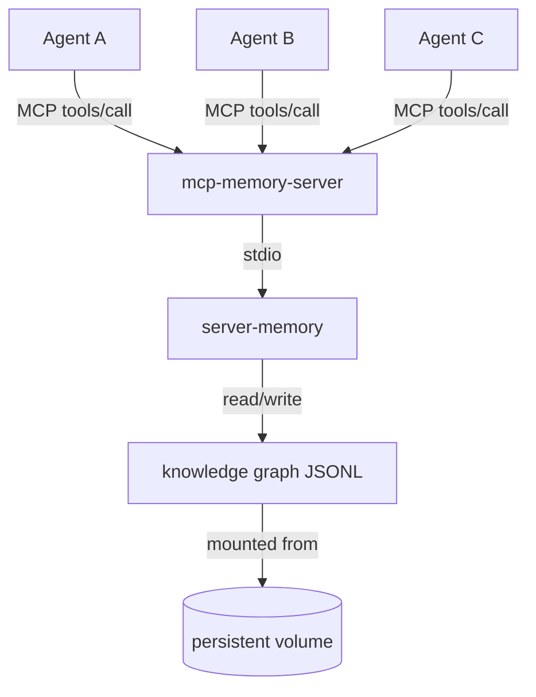
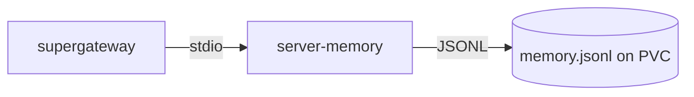

# mcp-memory-server

A persistent shared knowledge graph memory service for AI agents, exposed over the [Model Context Protocol (MCP)](https://modelcontextprotocol.io).

Built with [kagent](https://kagent.dev) in mind, but compatible with any agent framework that supports MCP over Streamable HTTP or SSE.

## What it does

Every AI agent invocation starts with a blank context window. This service gives agents a shared, persistent memory they can read from and write to across invocations — structured as a knowledge graph of entities, relations, and observations.



This project exists because there was no straightforward way to deploy a persistent MCP memory server into Kubernetes. The official [`@modelcontextprotocol/server-memory`](https://github.com/modelcontextprotocol/servers/tree/main/src/memory) package is excellent but speaks stdio only — not suitable for multi-agent Kubernetes workloads. This image wraps it with [supergateway](https://github.com/supermaven-inc/supergateway) to expose it over Streamable HTTP, packages everything into a single container, and publishes it to GHCR so it can be deployed with a single image reference. Ready-to-use deployment manifests are available both below and in the [`examples/`](examples/) folder of this repository.

### Knowledge graph model

| Concept | Description | Example |
|---------|-------------|--------|
| **Entity** | A named, typed object | `deployment/my-app` of type `KubernetesResource` |
| **Observation** | A free-text fact attached to an entity | `"OOMKilled 2026-05-16 — limit was 64Mi"` |
| **Relation** | A typed edge between two entities | `deployment/my-app` → `resolved_in` → `github-issue/42` |

### Why a knowledge graph instead of a flat file?

| Concern | Flat file | Knowledge graph |
|---------|-----------|----------------|
| Retrieval | Must read the whole file — grows unbounded | `search_nodes` returns only what's relevant |
| Typed relations | Prose the agent must parse | Machine-traversable edges |
| Concurrent writes | Risk of corruption | Each agent appends observations atomically |
| Pattern detection | Hard to reason over structure | `read_graph` exposes the full entity/relation set |

## MCP tools exposed

| Tool | Description |
|------|-------------|
| `create_entities` | Create named typed entities with initial observations |
| `create_relations` | Link two entities with a typed relation |
| `add_observations` | Append facts to an existing entity |
| `search_nodes` | Full-text search across entity names and observations |
| `open_nodes` | Retrieve specific entities by name |
| `read_graph` | Return the full knowledge graph |
| `delete_entities` | Remove entities and their relations |

## Quick start

### Docker

```bash
docker run -p 3000:3000 -v $(pwd)/data:/data ghcr.io/foxj77/mcp-memory-server:latest
```

The MCP endpoint is available at `http://localhost:3000/mcp`.

### Kubernetes (Deployment + PVC)

See [`examples/kubernetes-deployment.yaml`](examples/kubernetes-deployment.yaml) for the full manifest, or apply it directly:

```bash
kubectl apply -f https://raw.githubusercontent.com/foxj77/mcp-memory-server/main/examples/kubernetes-deployment.yaml
```

The manifest creates a PVC, Deployment, and Service. The MCP endpoint will be available at:
```
http://mcp-memory-server.<namespace>.svc.cluster.local:3000/mcp
```

<details>
<summary>View full manifest</summary>

```yaml
apiVersion: v1
kind: PersistentVolumeClaim
metadata:
  name: memory-store
  namespace: my-namespace
spec:
  accessModes: ["ReadWriteOnce"]
  resources:
    requests:
      storage: 2Gi
---
apiVersion: apps/v1
kind: Deployment
metadata:
  name: mcp-memory-server
  namespace: my-namespace
spec:
  replicas: 1
  selector:
    matchLabels:
      app: mcp-memory-server
  template:
    metadata:
      labels:
        app: mcp-memory-server
    spec:
      containers:
        - name: mcp-memory-server
          image: ghcr.io/foxj77/mcp-memory-server:latest
          imagePullPolicy: Always
          env:
            - name: NODE_OPTIONS
              value: "--max-old-space-size=256"
          ports:
            - containerPort: 3000
          volumeMounts:
            - name: memory-store
              mountPath: /data
          resources:
            requests:
              cpu: 10m
              memory: 256Mi
            limits:
              cpu: 500m
              memory: 768Mi
      volumes:
        - name: memory-store
          persistentVolumeClaim:
            claimName: memory-store
---
apiVersion: v1
kind: Service
metadata:
  name: mcp-memory-server
  namespace: my-namespace
spec:
  selector:
    app: mcp-memory-server
  ports:
    - port: 3000
      targetPort: 3000
```

</details>

## Wiring to kagent

See [`examples/kagent-remote-mcp-server.yaml`](examples/kagent-remote-mcp-server.yaml) for the full manifest. Register the server as a `RemoteMCPServer` and add the tools to each agent's tool list.

```yaml
apiVersion: kagent.dev/v1alpha2
kind: RemoteMCPServer
metadata:
  name: memory-mcp
  namespace: kagent
spec:
  description: Shared persistent knowledge graph memory
  protocol: STREAMABLE_HTTP
  url: http://mcp-memory-server.my-namespace.svc.cluster.local:3000/mcp
  timeout: 30s
  sseReadTimeout: 5m0s
```

Then add tools to each agent based on its role:

```yaml
# Full read + write (resolver, advisor agents)
- type: McpServer
  mcpServer:
    apiGroup: kagent.dev
    kind: RemoteMCPServer
    name: memory-mcp
    toolNames:
      - create_entities
      - create_relations
      - add_observations
      - search_nodes
      - open_nodes
      - read_graph

# Observe + read (analyst agents)
- type: McpServer
  mcpServer:
    apiGroup: kagent.dev
    kind: RemoteMCPServer
    name: memory-mcp
    toolNames:
      - add_observations
      - search_nodes
      - open_nodes
      - read_graph

# Read-only (general-purpose agents)
- type: McpServer
  mcpServer:
    apiGroup: kagent.dev
    kind: RemoteMCPServer
    name: memory-mcp
    toolNames:
      - search_nodes
      - open_nodes
      - read_graph
```

## Wiring to other frameworks

Any agent framework that can make HTTP POST requests to an MCP Streamable HTTP endpoint can use this server. The endpoint speaks standard JSON-RPC 2.0 over HTTP:

```bash
# Initialize a session
curl -si -X POST http://localhost:3000/mcp \
  -H "Content-Type: application/json" \
  -H "Accept: application/json, text/event-stream" \
  -d '{"jsonrpc":"2.0","id":1,"method":"initialize","params":{"protocolVersion":"2024-11-05","capabilities":{},"clientInfo":{"name":"test","version":"1.0"}}}'

# Use the returned mcp-session-id header for subsequent calls
curl -s -X POST http://localhost:3000/mcp \
  -H "Content-Type: application/json" \
  -H "Accept: application/json, text/event-stream" \
  -H "mcp-session-id: <session-id>" \
  -d '{"jsonrpc":"2.0","id":2,"method":"tools/call","params":{"name":"search_nodes","arguments":{"query":"my-app"}}}'
```

## Architecture

This server composes two existing tools:



| Component | Role |
|-----------|------|
| [`@modelcontextprotocol/server-memory`](https://github.com/modelcontextprotocol/servers/tree/main/src/memory) | Knowledge graph implementation stored as JSONL |
| [`supergateway`](https://github.com/supermaven-inc/supergateway) | Bridges the stdio MCP server to Streamable HTTP |

### Key configuration notes

**`--stateful` is required.** In default stateless mode, supergateway spawns a new stdio child process per HTTP connection. Because MCP requires `initialize` before `tools/call` within the same session, stateless mode breaks session continuity. The `--stateful` flag keeps one persistent process.

**Memory limit: 768Mi minimum.** Two Node.js processes run inside the container (supergateway + the memory server child process), each needing ~256MB heap. 512Mi OOMKills under load. Set `NODE_OPTIONS=--max-old-space-size=256` to cap each process.

**`imagePullPolicy: Always` for `:latest` / `:main` tags.** Kubernetes defaults to `IfNotPresent` for non-`:latest` tags, which will serve a cached old image after a new build. Use `Always` if you track a mutable tag.

## Image

Pre-built multi-arch images (amd64 + arm64) are published to GHCR on every push to `main`:

```
ghcr.io/foxj77/mcp-memory-server:latest
ghcr.io/foxj77/mcp-memory-server:main
ghcr.io/foxj77/mcp-memory-server:sha-<short-sha>
```

## Licence

MIT
